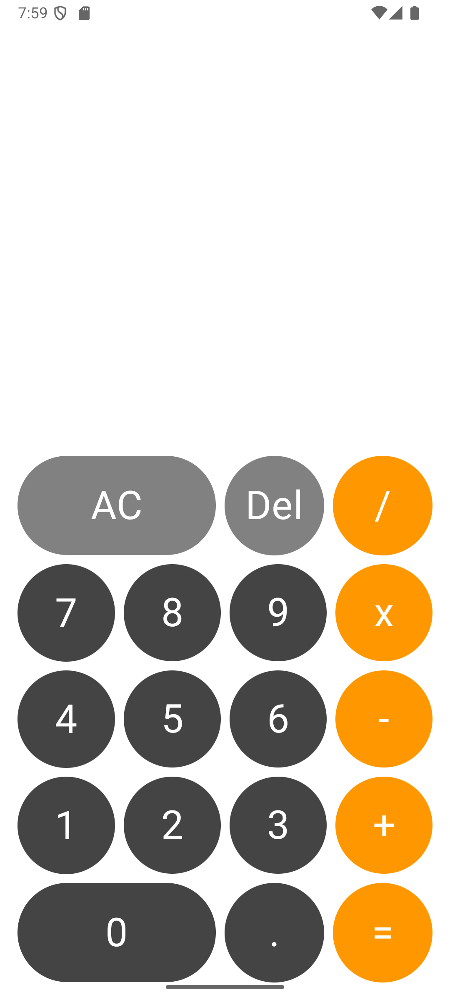

# Calculator App 📱

A simple yet functional arithmetic calculator built with **Jetpack Compose** and **MVVM** architecture, following modern Android development practices.

## Features ✨
- ➕➖✖️➗ Basic arithmetic operations (Add, Subtract, Multiply, Divide)
- 🔄 Clear and delete functionality
- ✔️ Decimal support
- 🚫 Error handling (e.g., division by zero)
- 📱 Responsive UI with Material 3 design

## Tech Stack 🛠️
- **Kotlin** - Primary programming language
- **Jetpack Compose** - Modern declarative UI toolkit
- **ViewModel** - For lifecycle-aware state management
- **Material 3** - Themed components for a polished look

## Screenshots 📸
| Light Mode |
|------------|
|  |

## Installation ⚙️
1. Clone the repository:
   ```bash
   https://github.com/muhammadhussain1911/Calculator.git
